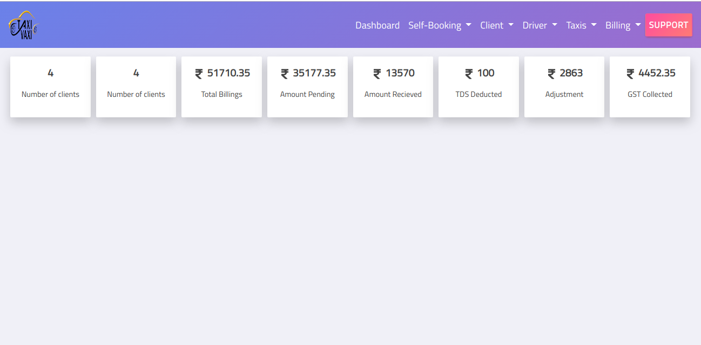
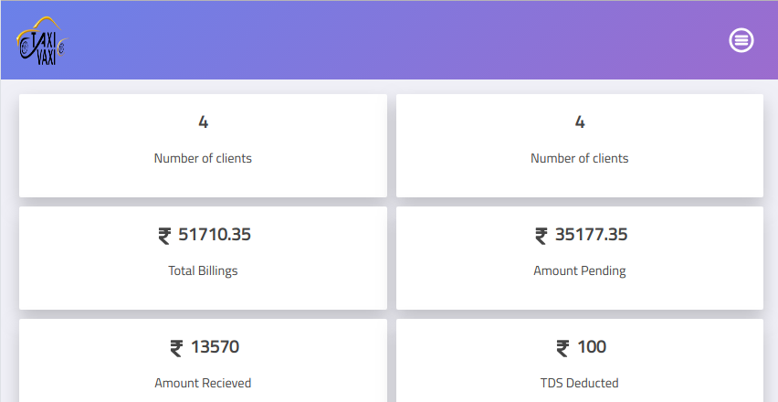
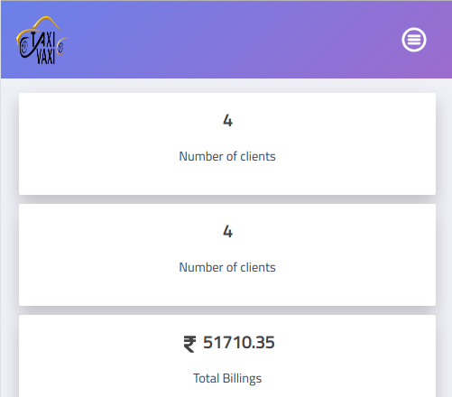

[Demo of responsive web page](https://designer199.github.io/final-nav-bar/)

## Dated : 2st Nov 2018

- [x] Add form page is completed and responsive for mobile ,tablet and desktop.

## Things that I noticed

 - [ ] The original sass code threw a lot of errors when compiled into css and the page was not responsive. So I had to  write new code in bootstrap 4 to make the form mobile-first/responsive.
 

## Dated : 1st Nov 2018

- [x] Counter section is completed and responsive for mobile ,tablet and desktop.
  
  ### Desktop View     
   
  
  ### Tablet View
    

### Mobile View

 

- [ ] I am currently working to make the add booking form responsive.

## Dated : 31 oct 2018

- [x] Navigation Bar is completed and responsive.

       

- [ ] I am currently working to make the add booking form responsive.
